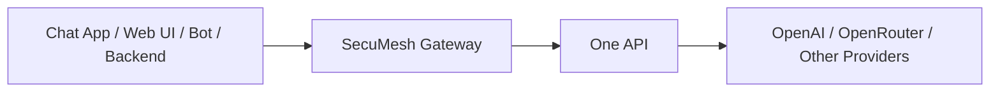
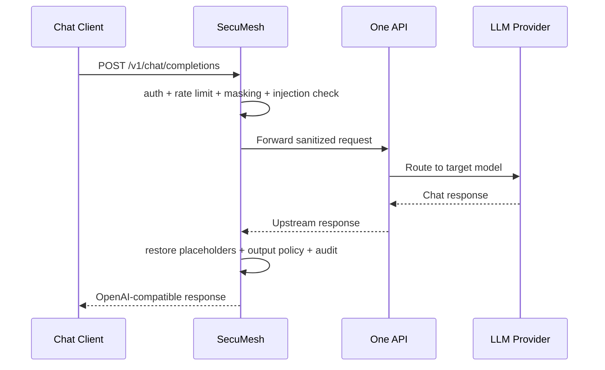

# SecuMesh Chat Integration Guide

This document describes the standard way to integrate a chat product, internal assistant,
or business application with the SecuMesh AI Security Gateway.

## 1. What SecuMesh Is

SecuMesh is an OpenAI-compatible security gateway that sits between your chat application
and One API or another upstream LLM provider.

Its current responsibility is to:

- authenticate gateway access
- inspect prompts for basic injection risks
- mask sensitive information before forwarding
- restore placeholders in model output
- log audit records for each request
- support both JSON and SSE streaming responses

SecuMesh is not a chat UI itself. It is the secure API layer in front of model access.

## 2. Integration Architecture



Recommended production pattern:

- client applications call SecuMesh only
- SecuMesh forwards traffic to One API
- upstream provider credentials are managed by backend systems, not exposed in browsers

## 3. Supported External API

SecuMesh currently exposes one main chat interface for business traffic:

- `POST /v1/chat/completions`

Operational and admin interfaces:

- `GET /health`
- `GET /ready`
- `GET /admin/audit`
- `GET /admin/audit/:requestId`
- `GET /admin/audit-ui`

For chat software integration, the main endpoint to use is:

- `POST /v1/chat/completions`

## 4. Request Compatibility

The gateway accepts OpenAI-style Chat Completions requests.

Current request shape:

```json
{
  "model": "openai/gpt-3.5-turbo",
  "stream": false,
  "user": "user-123",
  "messages": [
    {
      "role": "user",
      "content": "hello"
    }
  ]
}
```

Supported message content types:

- plain string content
- array content parts where text segments appear as `{ "type": "...", "text": "..." }`

This means the gateway can already work with many OpenAI-compatible chat frontends and
multi-part message formats, as long as they still use `/v1/chat/completions`.

## 5. Required and Recommended Headers

### Required Headers

- `Authorization: Bearer <gateway-internal-key>`
- `Content-Type: application/json`

### Recommended Headers

- `X-Session-Id: <your-conversation-id>`
- `X-Upstream-Api-Key: <one-api-token>`

### Optional Forwarded Headers

These headers are forwarded upstream when provided:

- `Accept`
- `OpenAI-Organization`
- `OpenAI-Project`
- `Anthropic-Version`
- `X-Request-Id`

## 6. Two-Layer Authentication Model

SecuMesh currently separates gateway access from upstream provider access.

### Layer 1: Gateway Authentication

Used to decide whether a caller is allowed to use the SecuMesh gateway.

Example:

```http
Authorization: Bearer internal-demo-key
```

### Layer 2: Upstream Authentication

Used by SecuMesh when forwarding the request to One API or another upstream provider.

Recommended current approach:

```http
X-Upstream-Api-Key: sk-xxxxxxxx
```

Notes:

- If `UPSTREAM_API_KEY` is configured on the gateway, it can be used as a server-side default.
- If `X-Upstream-Authorization` is provided, it takes precedence over `X-Upstream-Api-Key`.
- For browser-based products, do not expose upstream provider tokens in frontend code.

## 7. Recommended Session Strategy

Always send a stable `X-Session-Id` for each conversation.

Example:

```http
X-Session-Id: session-001
```

This is important because SecuMesh uses session context for:

- placeholder mapping during sensitive data masking
- de-anonymization on the response path
- audit correlation across requests

Recommended source for `X-Session-Id`:

- your chat thread id
- your conversation id
- your customer support ticket id
- your bot conversation key

## 8. Standard Request Flow



## 9. Example Integration Modes

### Mode A: Existing OpenAI-Compatible Chat Frontend

If your frontend already supports custom OpenAI endpoints, the minimum change is:

- change `Base URL` to SecuMesh
- change `API Key` to the SecuMesh internal key

If custom headers are supported, also send:

- `X-Session-Id`
- `X-Upstream-Api-Key`

### Mode B: Your Own Backend Calls the Gateway

This is the recommended production approach.

Your application backend sends requests to SecuMesh, and SecuMesh forwards them upstream.

Benefits:

- upstream credentials stay on the server side
- audit remains complete
- future policy controls can be applied centrally

### Mode C: Multiple Internal Clients Share One Gateway

Examples:

- web chat application
- enterprise bot
- internal knowledge assistant
- test tools and scripts

All of them call SecuMesh, which becomes the single security and policy enforcement layer.

## 10. Curl Example

```sh
curl http://127.0.0.1:9080/v1/chat/completions \
  -H "Authorization: Bearer internal-demo-key" \
  -H "X-Upstream-Api-Key: sk-xxxx" \
  -H "X-Session-Id: session-001" \
  -H "Content-Type: application/json" \
  -d '{
    "model": "openai/gpt-3.5-turbo",
    "stream": false,
    "messages": [
      {
        "role": "user",
        "content": "hello"
      }
    ]
  }'
```

## 11. JavaScript Example

```ts
const response = await fetch("http://127.0.0.1:9080/v1/chat/completions", {
  method: "POST",
  headers: {
    "Authorization": "Bearer internal-demo-key",
    "X-Upstream-Api-Key": "sk-xxxx",
    "X-Session-Id": "session-001",
    "Content-Type": "application/json"
  },
  body: JSON.stringify({
    model: "openai/gpt-3.5-turbo",
    stream: false,
    messages: [
      { role: "user", content: "hello" }
    ]
  })
});

const data = await response.json();
console.log(data);
```

## 12. Streaming Example

SecuMesh supports OpenAI-style streaming responses.

Example request:

```json
{
  "model": "openai/gpt-3.5-turbo",
  "stream": true,
  "messages": [
    {
      "role": "user",
      "content": "hello"
    }
  ]
}
```

When upstream returns `text/event-stream`, SecuMesh preserves SSE behavior while applying
placeholder restoration and output filtering.

## 13. Deployment Recommendations

### For Local Development

- run One API locally
- run SecuMesh locally
- use `UPSTREAM_BASE_URL=http://localhost:3000`

### For Docker Compose

- run SecuMesh and Redis in containers
- point `UPSTREAM_BASE_URL` to the hostname visible inside the container network
- avoid using `localhost` unless the upstream service is in the same container

## 14. Security Integration Recommendations

For production integration, the recommended design is:

- browser or app calls your own backend
- your backend calls SecuMesh
- SecuMesh calls One API

This avoids exposing:

- One API tokens
- provider API keys
- internal routing strategy

It also gives you one place to enforce:

- model allowlists
- audit collection
- sensitive data masking
- future user and organization policies

## 15. Current Limitations

At the moment, SecuMesh is focused on the MVP chat path.

Current practical limitations:

- only `/v1/chat/completions` is implemented for model traffic
- admin auth is still evolving toward a more formalized mechanism
- audit persistence is file-based today
- advanced policy routing is not yet fully implemented
- ClickHouse persistence is planned but not yet wired in

## 16. Recommended Client Contract

If another team is integrating with SecuMesh, the recommended contract is:

### Request

- call `POST /v1/chat/completions`
- send OpenAI-compatible JSON
- send `Authorization`
- send `X-Session-Id`
- do not call One API directly from the frontend in production

### Response

- expect OpenAI-compatible JSON for non-stream requests
- expect SSE for stream requests
- expect gateway-generated JSON error objects on auth, policy, or upstream failure

## 17. Minimum Fields to Standardize in Client Integrations

To make later auditing and governance easier, downstream clients should consistently provide:

- conversation id as `X-Session-Id`
- end-user id in request `user` when available
- stable request tracing id via `X-Request-Id` when available
- explicit model name in `model`

## 18. Summary

The shortest way to understand SecuMesh integration is:

- your chat system sends OpenAI-style requests to SecuMesh
- SecuMesh performs security processing and auditing
- SecuMesh forwards the request to One API
- the response comes back in the same OpenAI-compatible shape

For most chat products, initial integration only requires changing:

- base URL
- gateway API key
- one additional session header
